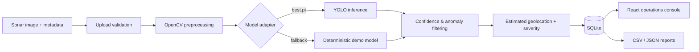

# MARINEGUARD AI

MarineGuard AI is a hackathon-ready, full-stack prototype for turning side-scan sonar imagery into an actionable marine-hazard workflow: ingest → preprocess → detect → filter → geolocate → prioritize → report.

> Scientific honesty: the bundled fallback is a deterministic **Prototype / Demonstration Model**. Estimated positions use a simplified cross-track calculation and are not survey-grade.

## Features

- FastAPI API with validated PNG/JPG/JPEG/TIFF and optional CSV/JSON metadata uploads
- OpenCV sonar preprocessing: median speckle reduction, CLAHE, normalization
- Model adapter layer (`YOLOModel`, `DemoModel`; automatically selects `models/best.pt` if supplied)
- Confidence and anomaly filters, severity scoring, SQLite survey/detection records
- CSV/JSON export and a responsive marine-intelligence React dashboard
- Sonar overlay viewer, anomaly detail workflow, survey archive, chart-ready data model, estimated-position map visualization

## Architecture



## Run locally

Requires Python 3.11+ and Node 20+.

```powershell
cd marineguard-ai\backend
python -m venv .venv
.\.venv\Scripts\Activate.ps1
pip install -r requirements.txt
uvicorn app.main:app --reload --port 8000
```

In another terminal:

```powershell
cd marineguard-ai\frontend
npm install
npm run dev
```

Open `http://localhost:5173`; API docs are at `http://localhost:8000/docs`.

## Demo workflow

1. Select **Load Demo Survey**.
2. Open **Sonar Analysis** and choose **Analyze Sonar Data**.
3. Inspect drawn detections, select a table row for details, and use CSV/JSON export.
4. To enable estimated coordinates, upload a CSV with `ping_id,timestamp,latitude,longitude,heading,range` alongside an image.

## Real YOLO model

Place compatible Ultralytics weights at `models/best.pt` (create the `models` directory at project root). Add `ultralytics` and a matching PyTorch runtime to the backend environment. The adapter selects it at startup; the frontend API does not change.

## Project layout

`backend/app` contains API, persistence, preprocessing, AI adapters, filters, geolocation and reports. `frontend/src` contains the React console. `tests` is reserved for pipeline tests; add production dataset fixtures there rather than mixing them with demo assets.

## Limits and next steps

This prototype uses image-normalized dimensions and simplified metadata georeferencing. A deployment needs calibrated sonar pixel/slant range geometry, INS/IMU fusion, known shadow-object pairing, benchmarked detection metrics, asynchronous job queues, object storage, access control, real map tiles and field validation. Train a labeled SSS dataset in YOLO format, evaluate class-wise precision/recall, export to ONNX, and benchmark TensorRT on the target AUV/USV compute hardware.
